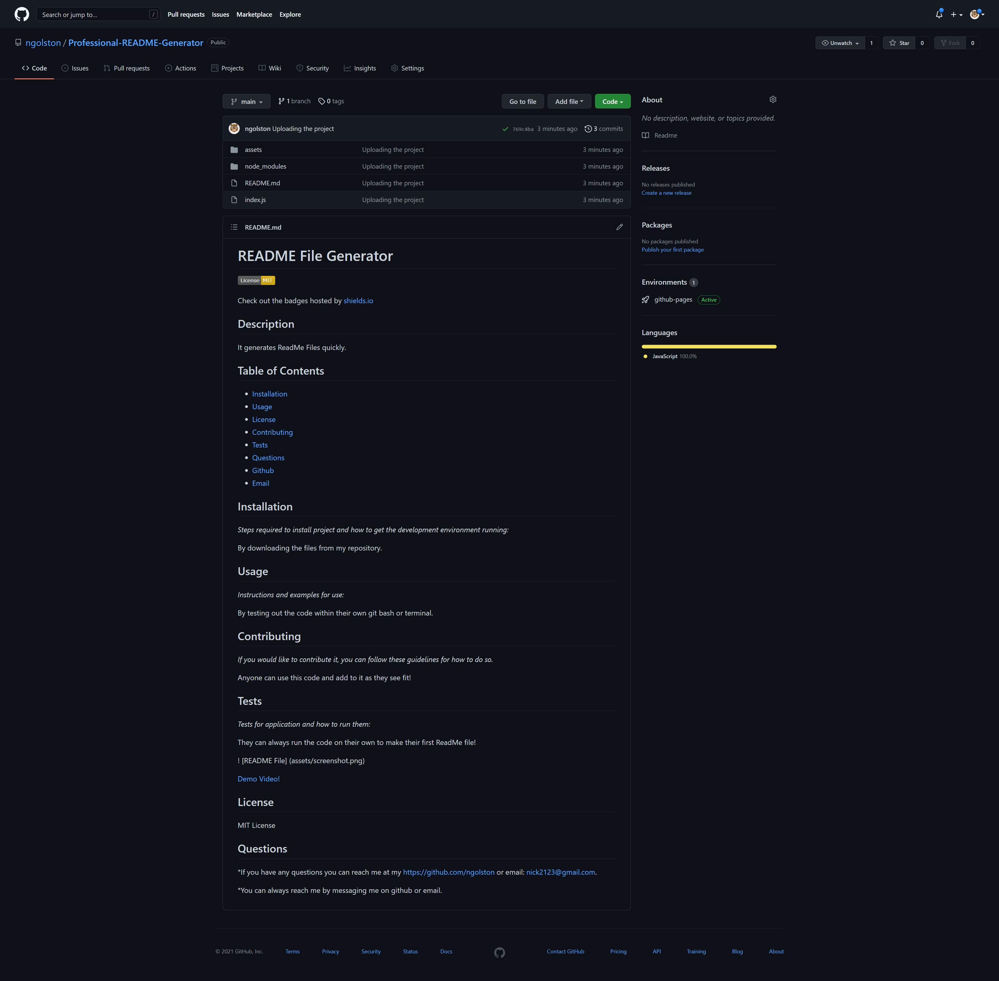

# README File Generator

Check out the badges hosted by [shields.io](https://shields.io/)

## Description

It generates ReadMe Files quickly.

## Table of Contents

- [Installation](#installation)
- [Usage](#usage)
- [License](#license)
- [Contributing](#contributing)
- [Tests](#tests)
- [Questions](#questions)

## Installation

_Steps required to install project and how to get the development environment running:_

By downloading the files from my repository.

## Usage

_Instructions and examples for use:_

By testing out the code within their own git bash or terminal.

## Contributing

_If you would like to contribute it, you can follow these guidelines for how to do so._

Anyone can use this code and add to it as they see fit!

## Tests

_Tests for application and how to run them:_

They can always run the code on their own to make their first ReadMe file!

[Demo Video!](https://youtu.be/DzVYsVszZZA)

## License

MIT License

## Questions

\*If you have any questions you can reach me at my Github: https://github.com/ngolston or Email: nick2123@gmail.com.

\*You can always reach me by messaging me on github or email.
